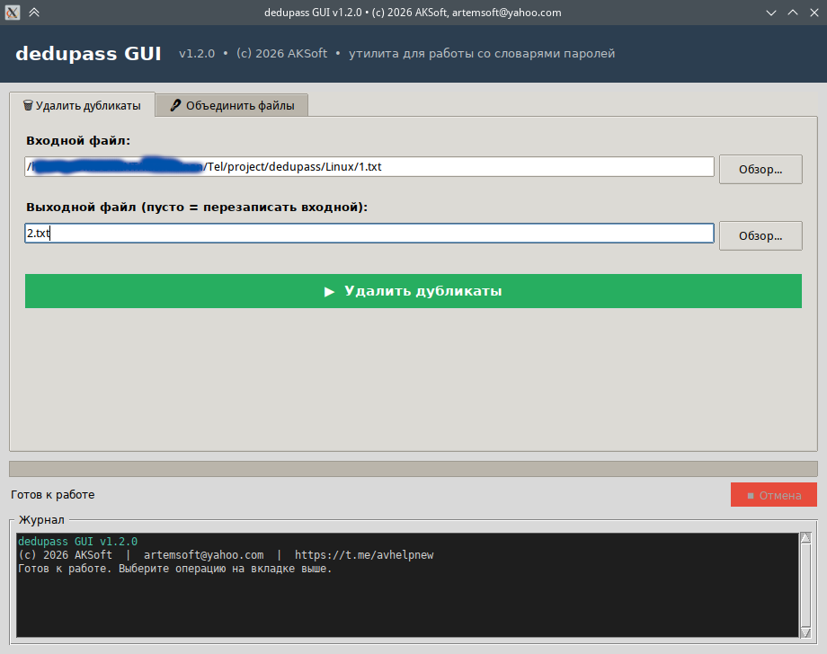

# dedupass 1.2

> **Утилита для работы со словарями паролей** — удаление дубликатов и объединение текстовых файлов.
> **Password dictionary utility** — deduplicate and merge text files.

[](https://github.com/yourname/dedupass/releases)
[]()
[](https://www.python.org/)
[](LICENSE.txt)

---

## О проекте

**dedupass** — кроссплатформенная утилита для работы со словарями паролей. Позволяет быстро удалять дубликаты и объединять несколько файлов в один. Работает с файлами любого размера — проверено на словарях **100+ ГБ**.

Доступна в двух версиях:
- **CLI** (консольная) — для опытных пользователей
- **GUI** (графическая) — для всех

Обе версии полностью автономны: не требуют интернета или прав администратора.

---

## Возможности

| Возможность | Описание |
|---|---|
| **Удаление дубликатов** | Очистка одного файла от повторяющихся строк |
| **Объединение файлов** | Слияние нескольких словарей с удалением дубликатов |
| **Файлы-списки** | Списки файлов с поддержкой вложенности (`@list.txt`) |
| **Маски файлов** | `*.txt`, `data/*.txt`, `*/*.txt`, `2024_*.txt` |
| **Автоопределение кодировки** | UTF-8, CP1251, CP866, KOI8-R, Latin-1, ISO-8859-1 |
| **Большие файлы** | Потоковая обработка 100+ ГБ |
| **Прогресс** | Реальный процент выполнения в GUI |
| **Безопасное прерывание** | Ctrl+C в CLI, кнопка «Отмена» в GUI |
| **Безопасность** | Не отправляет данные в интернет, не требует root |

---

## Скачать

### Готовые бинарники

Перейдите в раздел [**Releases**](https://github.com/artemsoft2025/dedupass/releases) и скачайте:

| Платформа | Файл | Размер |
|---|---|---|
| **Windows (CLI)** | `dedupass.exe` | ~6 МБ |
| **Windows (GUI)** | `dedupass_gui.exe` | ~12 МБ |
| **Linux (CLI)** | `dedupass` | ~6 МБ |
| **Linux (GUI)** | `dedupass_gui` | ~11 МБ |

### Установка

**Windows** — скачайте `.exe` и запустите. Установка не требуется.

**Linux** — дайте файлам право на выполнение:

```bash
chmod +x dedupass dedupass_gui
./dedupass          # CLI
./dedupass_gui      # GUI
```


---

## Быстрый старт

### CLI (консольная версия)

```bash
# Удалить дубликаты в файле (перезаписать)
dedupass --remove-duplicates rockyou.txt
dedupass -rd rockyou.txt

# Создать очищенную копию
dedupass --output clean.txt dirty.txt
dedupass -o clean.txt dirty.txt

# Объединить несколько файлов
dedupass -o combined.txt file1.txt file2.txt file3.txt

# Объединить все .txt в папке
dedupass -o all.txt "passwords/*.txt"

# Использовать файл-список
dedupass --list my.list --output result.txt

# Интерактивный режим (меню)
dedupass
```

### GUI (графическая версия)

Просто запустите `dedupass_gui.exe` (Windows) или `./dedupass_gui` (Linux).
Откроется окно с двумя вкладками: **«Удалить дубликаты»** и **«Объединить файлы»**.

---

## Скриншоты

### Графическая версия



### Консольная версия — интерактивное меню

```
============================================================
   [(c) 2026 AKSoft v1.2.0 dedupass]
   artemsoft@yahoo.com | https://t.me/avhelpnew
============================================================
          dedupass - Утилита для работы
              со словарями паролей
============================================================
1. Удалить дубликаты в файле
2. Объединить несколько файлов
3. Использовать файл со списком
4. Показать справку
5. Выйти
------------------------------------------------------------
Выберите действие (1-5): _
```

---

## Файлы-списки

Создайте файл `.list` или `.txt` со списком файлов:

```txt
# Список словарей для обработки
rockyou.txt
passwords/darkc0de.txt
folder/*.txt
data/2024_*.txt
@additional.list

# Абсолютные пути тоже работают
/home/user/dictionaries/special.txt
```

Правила:
- `#` — комментарий
- `@file.list` — вложенный список
- `~` — домашняя директория
- Пустые строки игнорируются

Использование:

```bash
dedupass --list my.list --output result.txt
```

---

## Маски файлов

| Маска | Что находит |
|---|---|
| `*.txt` | все .txt в текущей папке |
| `data/*.txt` | все .txt в папке data |
| `*/*.txt` | все .txt в подпапках (1 уровень) |
| `*/*/*.txt` | все .txt в подпапках (2 уровня) |
| `2024_*.txt` | файлы, начинающиеся с `2024_` |
| `password?.txt` | password1.txt, password2.txt и т.д. |

⚠️ **В Linux маски нужно заключать в кавычки**:

```bash
dedupass -o all.txt "passwords/*.txt"
```

---

## ❓ FAQ

**Почему файл после обработки стал больше?**

Возможно, файл был в однобайтовой кодировке (CP1251), а сохранён в UTF-8. Или добавились завершающие переводы строк. Это нормально.

**Почему не все дубликаты удалены?**

Дубликаты определяются по точному совпадению после trim. `password` и `Password` — разные строки (регистр учитывается).

**Антивирус ругается на бинарник**

Ложное срабатывание из-за упаковки PyInstaller. Файл безопасен. 

**Как обрабатывать файлы 100+ ГБ?**

Утилита автоматически использует потоковый режим для больших файлов (50 МБ для дедупа, 500 МБ для merge). Работает с файлами любого размера, если хватает места на диске.

---

## Журнал изменений

### v1.2 (2026)
- 🐧 Linux-версия (CLI + GUI)
- 🐛 Исправлены критические баги (Progressbar, форматирование размеров, потеря дубликатов между чанками)
- 🚀 Потоковая обработка больших файлов (100+ ГБ)
- 🔤 Улучшено определение кодировки (3 фрагмента)
- 💾 Построчная оптимизация файла (вместо чтения всего в память)
- 📚 Улучшена справка
- 🆕 `--version` выводит версию и копирайт

### v1.1 (2025)
- 🎉 Первая публичная версия
- Поддержка масок файлов
- Файлы-списки с вложенностью
- Автоопределение кодировки

---

## Как помочь проекту

- ⭐ **Нравится проект?** → Поставьте звезду!

---

## Лицензия

Свободное использование в личных и коммерческих целях.
Автор не несёт ответственности за возможный ущерб.

---

## Контакты

- **Автор**: AKSoft
- **Email**: artemsoft@yahoo.com
- **Telegram**: [@avhelpnew](https://t.me/avhelpnew)

---

